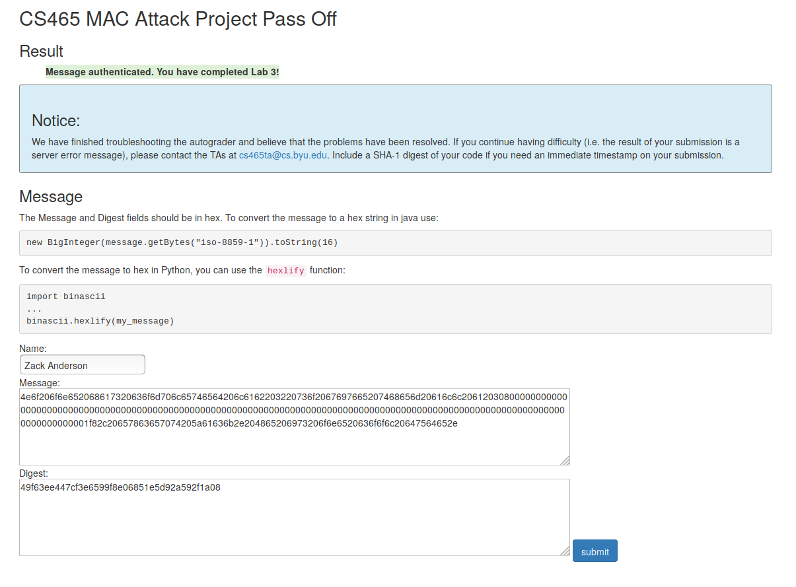

# Project 3: MAC Attack

Run the extension attack with

`python3 macattack.py`

or

`./macattack.py`

It will automatically print out the resulting extended message and digest for the autograder.

 

I also have `test.py` which makes up a key Alice and Bob share, then runs the full attack. This way I can test that Mallory's extended message will verify with the key when Bob gets it.

